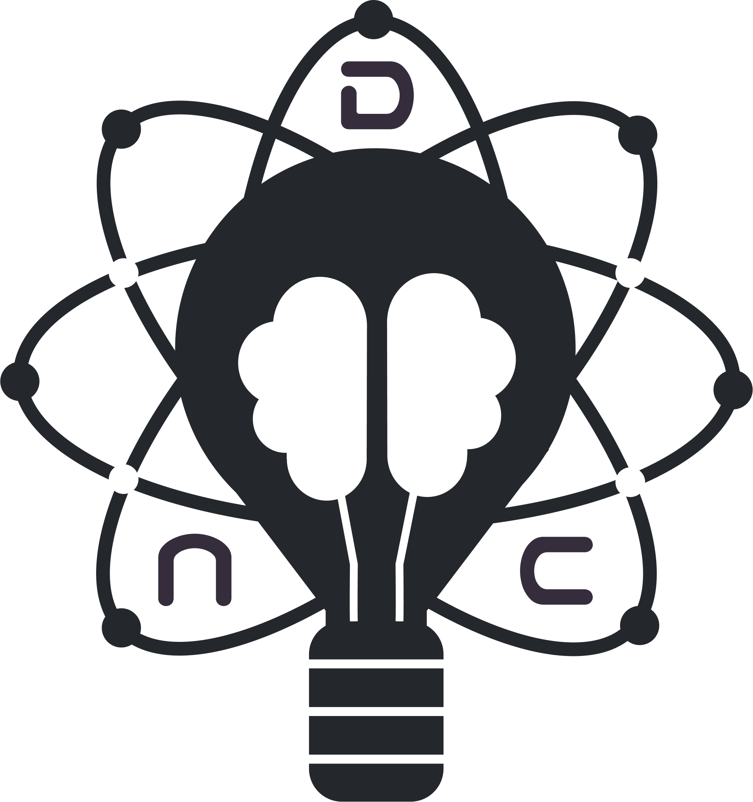
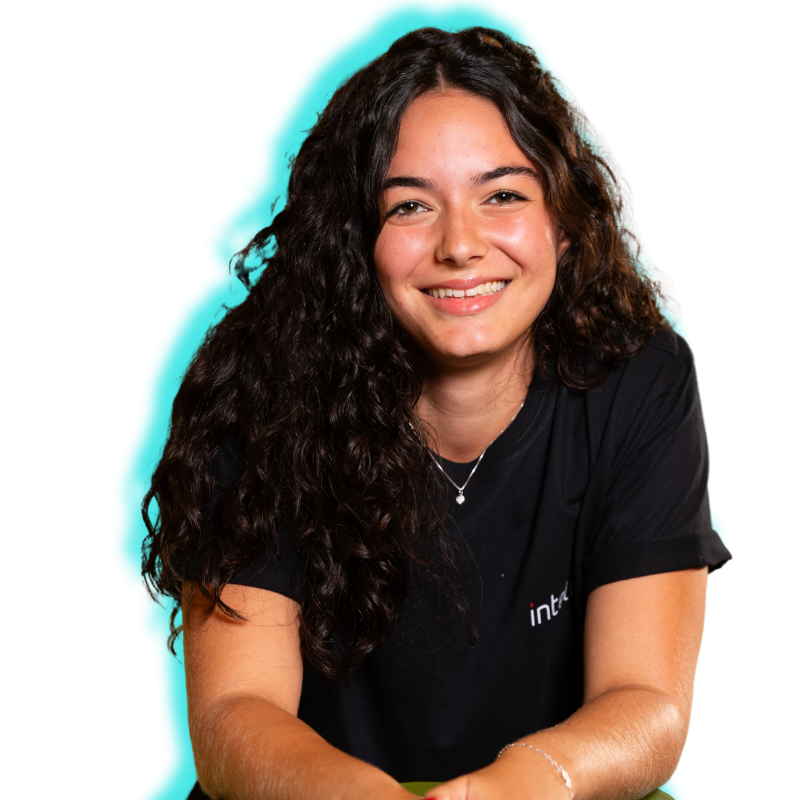
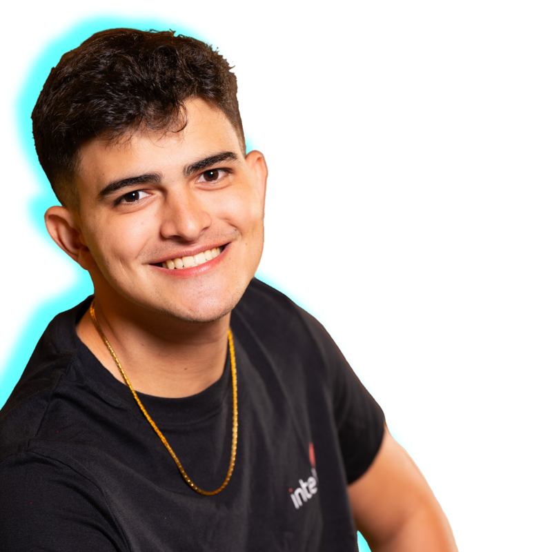

<div align="center">

# NDC System 💊

</div>

## 🎥 [Acesse o vídeo da nossa solução aqui!](https://youtu.be/khbtYsOoS_E)

## 👥 Grupo 3 - NDC
<p align="center">
  <a href= "https://www.inteli.edu.br/"></a>
</p>


## 👨‍🎓 Integrantes: 
<div align="center">
  <table>
    <tr>
      <td align="center">
        <a href="https://www.linkedin.com/in/fernando-soares-oliveira/">
          <br>
          <sub><b>Fernando Oliveira</b></sub>
        </a>
      </td>
      <td align="center">
        <a href="https://www.linkedin.com/in/cecilslico/">
          <br>
          <sub><b>Cecília Coelho</b></sub>
        </a>
      </td>
      <td align="center">
        <a href="https://www.linkedin.com/in/ceciliagalvaoo/">
          <br>
          <sub><b>Cecília Galvão</b></sub>
        </a>
      </td>
      <td align="center">
        <a href="https://www.linkedin.com/in/ian-pereira-simao/">
          <br>
          <sub><b>Ian Simão</b></sub>
        </a>
      </td>
      <td align="center">
        <a href="https://www.linkedin.com/in/luizapetenazzi/">
          <br>
          <sub><b>Luiza Petenazzi</b></sub>
        </a>
      </td>
      <td align="center">
        <a href="https://www.linkedin.com/in/miguelclaret/">
          <br>
          <sub><b>Miguel Claret</b></sub>
        </a>
      </td>
      <td align="center">
        <a href="https://www.linkedin.com/in/pabloazevedo/">
          <br>
          <sub><b>Pablo Azevedo</b></sub>
        </a>
      </td>
    </tr>
  </table>
</div>


## 👩‍🏫 Professores:

### Orientador(a) 
- [Murilo Zanini de Carvalho](https://www.linkedin.com/in/murilo-zanini-de-carvalho-0980415b/)

### Instrutores
- [Lisane Valdo](https://www.linkedin.com/in/lisane-valdo/)
- [Guilherme Cestari](https://www.linkedin.com/in/gui-cestari/)
- [Geraldo Magela Severino Vasconcelos](https://www.linkedin.com/in/geraldo-magela-severino-vasconcelos-22b1b220/)
- [Rodrigo Nicola](https://www.linkedin.com/in/rodrigo-mangoni-nicola-537027158/)
- [André Godoi](https://www.linkedin.com/in/andregodoichiovato/)
- [Filipe Gonçalves](https://www.linkedin.com/in/filipe-gon%C3%A7alves-08a55015b/)

## 📜 Descrição

A solução proposta é o desenvolvimento de um sistema automatizado utilizando um braço mecânico e sensores para otimizar a separação e montagem das “Fitas de medicamentos” no Hospital de Clínicas da Unicamp. O sistema realizará a seleção precisa de medicamentos com base em prescrições eletrônicas, validando cada item por meio de leitura de código de barras, peso e volume, além de integrar-se ao estoque hospitalar para atualizações em tempo real. A proposta visa garantir maior segurança aos pacientes, reduzir erros humanos e aumentar a eficiência operacional, substituindo processos manuais por automação e proporcionando controle desde a dispensação até a entrega dos kits medicamentosos.

## 📁 Estrutura de Pastas

Na raiz do projeto, você vai encontrar pastas e arquivos que são como os "organizadores de bagunça" do desenvolvimento. Eis o que cada um faz:

📦 **Projeto NDC System** (2025-1A-T12-EC05-G03)

├── 📂 docs <br/>
│ ├── **docs** <br/>
│ │ ├── **Sprint 1** — Documentação da Sprint 1 para o Docusaurus <br/>
│ │ ├── **Sprint 2** — Documentação da Sprint 2 para o Docusaurus <br/>
│ │ ├── **Sprint 3** — Documentação da Sprint 3 para o Docusaurus <br/>
│ │ ├── **Sprint 4** — Documentação da Sprint 4 para o Docusaurus <br/>
│ │ └── **Sprint 5** — Documentação da Sprint 5 para o Docusaurus <br/>
│ │ <br/>
│ ├── **src** <br/>
│ │ ├── **components/HomepageFeatures** — Componentes da página inicial do Docusaurus <br/>
│ │ ├── **css** — Estilização personalizada do Docusaurus <br/>
│ │ └── **pages** — Páginas e conteúdos estruturados para o Docusaurus <br/>
│ │ <br/>
│ └── **static/img** — Imagens estáticas usadas no Docusaurus <br/>
│ <br/>
├── 📂 media <br/>
│ ├── **Logos_GuiaDeEstilos** — Logos e guia de estilos do projeto <br/>
│ ├── **NDCers** — Fotos dos integrantes do grupo para o README <br/>
│ ├── **codigo** — Imagens de exemplos de código <br/>
│ ├── **componentes** — Imagens dos componentes utilizados no projeto <br/>
│ ├── **fisico** — Esquemáticos e diagramas do projeto físico <br/>
│ ├── **personas** — Representações visuais das personas do projeto <br/>
│ └── **wireflow** — Fluxogramas de telas e interações do projeto <br/>
│ <br/>
├── 📂 src <br/>
│ ├── **api** <br/>
│ │ ├── **models** — Modelos de dados da API <br/>
│ │ └── **routes** — Rotas e endpoints da API <br/>
│ │ <br/>
│ ├── **firmware** <br/>
│ │ ├── **NDCbot** — Arquivos e componentes do NDCBot <br/>
│ │ │ ├── **Modules** — Módulos de funcionalidades do NDCBot <br/>
│ │ │ └── **Positions** — Gerenciamento de posições do NDCBot <br/>
│ │ │ <br/>
│ │ └── **codigos_apoio** — Códigos auxiliares de suporte <br/>
│ │ <br/>
│ └── **front-end** <br/>
│ ├── **CSS** — Estilos visuais da interface do projeto <br/>
│ └── **JS** — Scripts de interatividade da interface <br/>

<br/>

## 💻 Execução do Projeto

### 🐱‍🐉 Documentação — Docusaurus

Você pode acessar o nosso repositório via web por [aqui](https://inteli-college.github.io/2025-1A-T12-EC05-G03/)

#### Caso queira rodar localmente:

1. Clone o repositório na pasta de sua preferência.
```bash
git clone https://github.com/Inteli-College/2025-1A-T12-EC05-G03.git
```
2. Navegue até a pasta `docs`.
```bash
cd docs
```
3. No terminal, execute o comando:  
```bash
npm run start
```
Isso iniciará o Docusaurus localmente no seu computador, permitindo visualizar a documentação no navegador.

### 💊 Sistema — NDC System

1. Caso ainda não tenha clonado o repositório, clone-o na pasta de sua preferência.
```bash
git clone https://github.com/Inteli-College/2025-1A-T12-EC05-G03.git
```
2. Acesse a pasta `src`, depois `front-end`.
```bash
cd src
```   
3. Abra o arquivo `.html` desejado utilizando o Live Server ou outro serviço equivalente para visualizar o sistema em funcionamento.


## 🗃 Histórico de lançamentos

* 0.5.0 - 
    - Finalização projeto 
* 0.4.0 - 
    - Integração do back com o front 
* 0.3.0 - 
    - Front-end 
* 0.2.0 - 
    - Primeiros passos com o robô
* 0.1.0 - 
    - Entendimento do negócio

## 📋 Licença/License

<p xmlns:cc="http://creativecommons.org/ns#" xmlns:dct="http://purl.org/dc/terms/"><a property="dct:title" rel="cc:attributionURL" href="https://github.dev/Intelihub/Template_M3">Esti-Match</a> by <a rel="cc:attributionURL dct:creator" property="cc:attributionName" href="https://www.inteli.edu.br/">Inteli</a>, <a href="https://github.com/MiguelClaret">Miguel Claret<a>, <a href="https://github.com/ianpsa">Ian Simão</a>, <a href="https://github.com/zzaved">Pablo Azevedo</a>, <a href="https://github.com/Fernandoliveira05">Fernando Soares de Oliveira</a>, <a href="https://github.com/lupetenazzi">Luiza Petenazzi</a>, <a href="https://github.com/CecilsLaDiva">Cecília Coelho</a> is licensed under <a href="http://creativecommons.org/licenses/by/4.0/?ref=chooser-v1" target="_blank" rel="license noopener noreferrer" style="display:inline-block;">Attribution 4.0 International</a>.</p>
