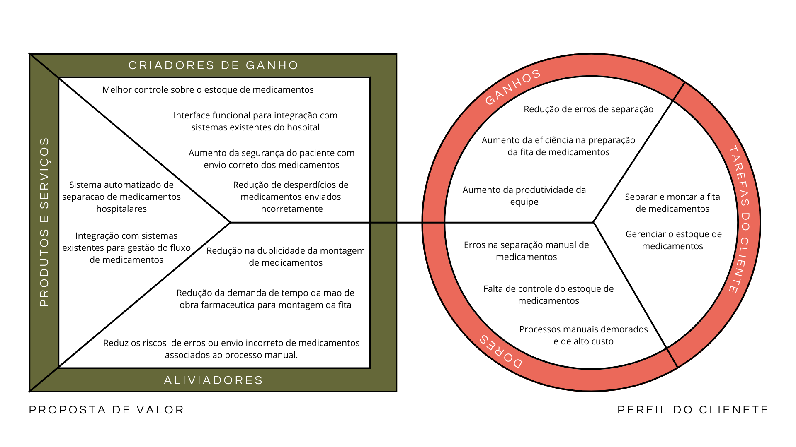

# Value Proposition Canva

&nbsp;&nbsp;&nbsp;&nbsp;O Canva de Proposta de Valor é uma ferramenta visual e estratégica utilizada para o desenvolvimento de produtos e soluções de projetos. A ferramenta é utilizada para mapear e entender as necessidades dos clientes, alinhando a proposta de valor às tarefas que eles precisam realizar, aos problemas que enfrentam e aos resultados que desejam alcançar. Por meio dessa abordagem, é possível ajustar os produtos e serviços para aliviar dores e criar ganhos relevantes, aumentando as chances de sucesso da solução no mercado. Essa metodologia é muito util para testar e melhorar a forma como a empresa cria valor, garantindo que as inovações da solução realmente atendam às expectativas dos consumidores.
 

Value proposition canva

Fonte: Elaborado pelos autores (2025)

 

&nbsp;&nbsp;&nbsp;&nbsp;Na seção "Proposta de Valor", há três componentes principais destacados na figura, que buscam trazer o valor da solução no modelo de negócios proposto.

**Produtos e Serviços:**
- Sistema automatizado de separação de medicamentos hospitalares.
- Integração com sistemas existentes para gestão do fluxo de medicamentos.

 

&nbsp;&nbsp;&nbsp;&nbsp;A proposta inclui o desenvolvimento de um sistema automatizado para a separação de medicamentos hospitalares, visando otimizar a eficiência dos processos que são realizados de maneira manual. Esse sistema será integrado aos sistemas já existentes, facilitando a gestão do fluxo de medicamentos e garantindo maior controle e segurança.

**Criadores de Ganho:**
- Melhor controle sobre o estoque de medicamentos.
- Interface funcional para integração com sistemas existentes.
- Aumento da segurança do paciente com o envio correto dos medicamentos.
- Redução de desperdícios de medicamentos enviados incorretamente.

 

&nbsp;&nbsp;&nbsp;&nbsp;Com essa solução, espera-se otimizar o processo de separação dos medicamentos, melhorar o controle sobre o estoque de medicamentos, aumentar a segurança do paciente ao garantir o envio correto dos medicamentos e reduzir desperdícios. A interface funcional permitirá uma integração eficiente com os sistemas do hospital, otimizando processos e aumentando a produtividade da equipe.

**Aliviadores de Dor:**
- Redução na duplicidade da montagem de medicamentos.
- Redução da demanda de tempo da mão de obra farmacêutica para montagem da fita.
- Redução de erros ou envio incorreto de medicamentos associados ao processo manual.

 

&nbsp;&nbsp;&nbsp;&nbsp;Essa solução visa resolver problemas relacionados à duplicidade na montagem de medicamentos, reduzir a carga de trabalho da equipe farmacêutica e minimizar os riscos de erros associados a processos manuais. O sistema automatizado proporcionará maior precisão e segurança na separação dos medicamentos.

&nbsp;&nbsp;&nbsp;&nbsp;Na seção "Segmentos de Clientes", também existem três componentes principais destacados na figura, que buscam trazer o papel do cliente no modelo de negócios atual.

**Trabalhos do Cliente:**
- Separar e montar a fita de medicamentos.
- Gerenciar o estoque de medicamentos.

 

&nbsp;&nbsp;&nbsp;&nbsp;Os clientes principais, que incluem as equipes farmacêuticas e de gestão hospitalar, têm a tarefa de separar e montar fitas de medicamentos, além de gerenciar o estoque de forma eficiente. O sistema proposto irá facilitar essas atividades, proporcionando maior controle e precisão nos processos.

**Dores:**
- Erros na separação manual de medicamentos.
- Falta de controle do estoque de medicamentos.
- Processos manuais demorados e de alto custo.

 

&nbsp;&nbsp;&nbsp;&nbsp;Atualmente, os processos manuais resultam em erros na separação de medicamentos, falta de controle eficiente do estoque e altos custos operacionais. O sistema automatizado proposto busca resolver esses desafios, proporcionando maior precisão, controle e redução de custos.

**Ganhos:**
- Redução de erros de separação.
- Aumento da eficiência na preparação da fita de medicamentos.
- Aumento da produtividade da equipe.

 

&nbsp;&nbsp;&nbsp;&nbsp;Com a implementação do sistema automatizado, espera-se uma redução significativa nos erros de separação, aumento da eficiência na preparação das fitas de medicamentos e maior produtividade da equipe. Isso resultará em um processo mais seguro, ágil e econômico para o ambiente hospitalar.

 

&nbsp;&nbsp;&nbsp;&nbsp;A partir dessa análise, conclui-se que a solução proposta para automação da separação para montagem da fita de medicamentos visa melhorar a eficiência operacional, reduzir erros e otimizar o uso de recursos. A integração com sistemas existentes e o foco na segurança do paciente garantem uma abordagem moderna e eficaz para os desafios enfrentados pelas instituições de saúde.

